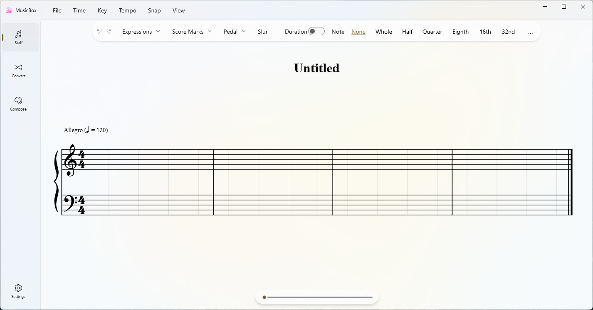

# MusicBox

MusicBox is a WinUI 3 desktop application for creating, editing, and converting music scores.

## Download

Users should download the app from the repository `Releases` page.

- `latest` release: newest development build from the default branch
- `v*` releases: versioned builds such as `v0.1.0`
- download `MusicBox-win-x64-*.zip`
- extract it to a normal folder
- run `MusicBox.exe`

If Windows shows a SmartScreen warning, click `More info`, then `Run anyway`.

How releases appear:
- every push to the default branch updates the `latest` prerelease automatically
- pushing a tag like `v0.1.0` creates a versioned release automatically

## Warning

This project is still in progress.

Features may be incomplete, behavior may change, and some parts of the app may still be unstable.

## Minimum System Requirement

- Windows 11
- x64

## Main Pages

### Editor Page

The Editor page is the score-writing workspace.

Features:
- Create and edit notes and rests directly on the staff.
- Change note length, accidentals, ornaments, articulation, slurs, tempo, key signature, and time signature.
- Adjust layout-related options such as snap division, measure ratio, measures per system, and display toggles.
- Play back the current score with timeline seeking and volume control.
- Import and export MusicXML.

Basic workflow:
1. Open the Editor page.
2. Choose note or rest mode.
3. Select the note length and any extra note attributes.
4. Click the staff to place notes, then drag or edit as needed.
5. Use the playback controls to review the result.

### Convert Page

The Convert page is used to turn the current score into numbered musical notation preview content.

Features:
- Import score data from the current editor project or from external files.
- Convert staff notation into Jianpu preview.
- Export the converted result to PDF.
- Export the source score to MusicXML.

Basic workflow:
1. Open the Convert page.
2. Import the current editor score or load a score file.
3. Review the generated Jianpu preview.
4. Export to PDF or MusicXML if needed.

## Notes

- The application supports both Chinese and English UI.
- Some features are still under active development and may change.
- Export, conversion, and editing behavior should be treated as evolving rather than final.
